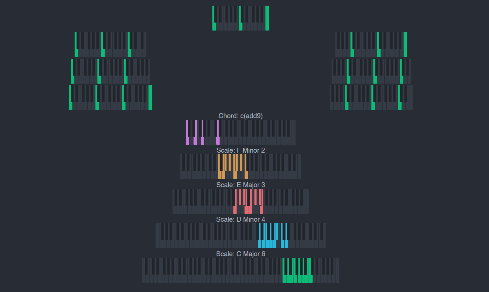

# hanon-dev

Customizeable virtual keyboard for future NPM package. Supports any modern keyboard layout, intuitive logic for scales and chords, MIDI input/output, and more



```html
<hanon
  :options="{
    maxHeight: "60px",
    padding: "10px 20px",
    color: {
      white: "var(--color-white)",
      black: "var(--color-black)",
      active: "var(--color-default)",
      hover: "var(--color-hover)",
      disabled: "var(--color-disabled)",
      locked: "var(--color-locked)"
    }"
  :amount="37"
  first-key="f"
  @keyOn="showKey"
  @keyOff=""
  @keyOver=""
  @keyOut=""
/>
```

